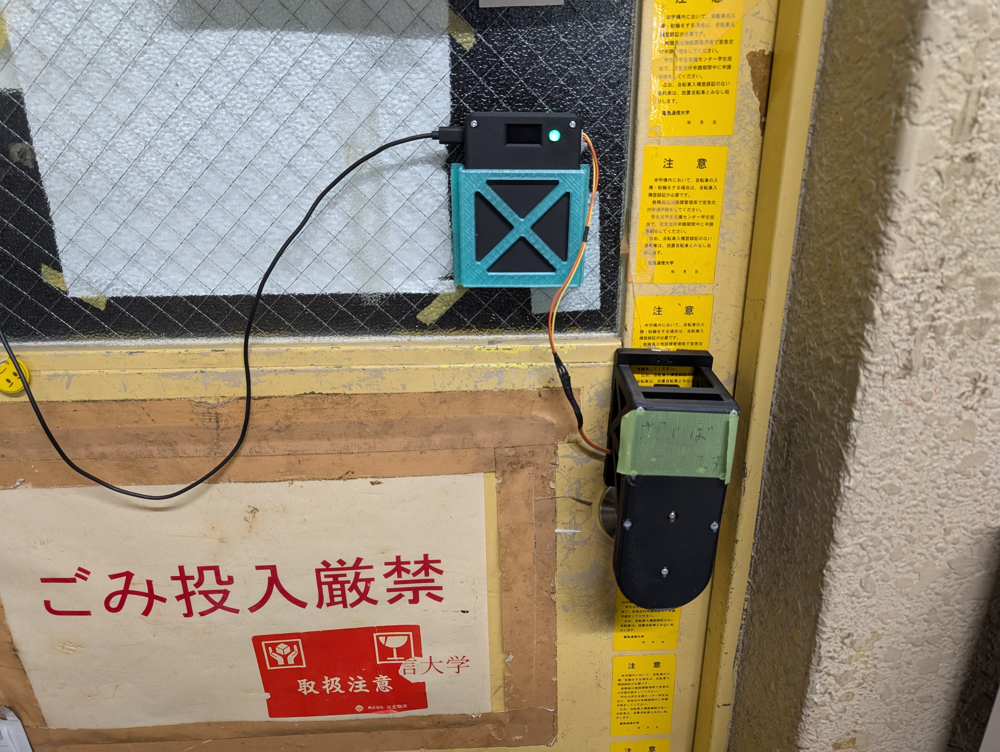
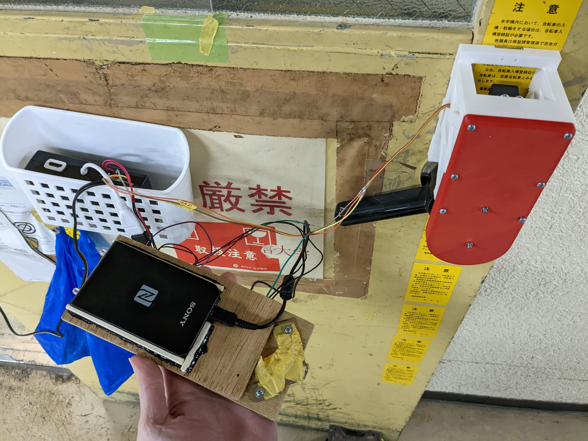
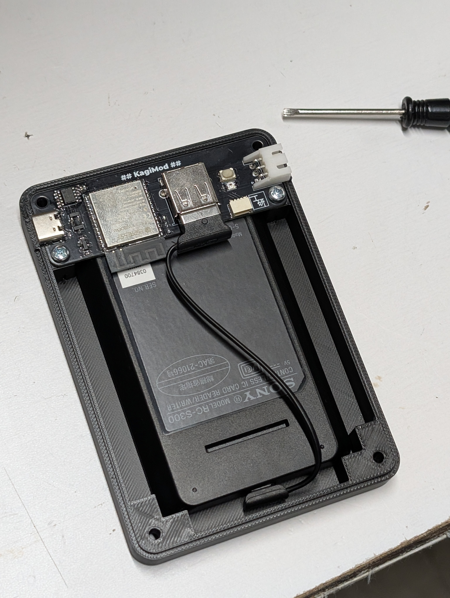
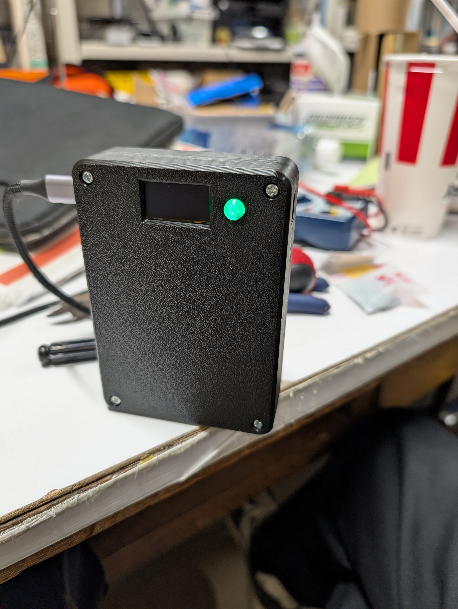

<!-- _class: lead -->

# ESP32で 工研部室の鍵modを リニューアルした話

### 24 Laddge

---
## 自己紹介

### Laddge (らっじ)
- 電気通信大学 情報理工学域 Ｉ類コンピュータサイエンス
- 趣味: Web開発、ハードウェア、Linux
- ハードウェア歴もうすぐ1年

---
## これまでの鍵mod

- Raspberry Pi、RC-S380(PaSoRi)
- 交通系ICのIDを読んで認証、サーボモーターでサムターンを回す
- OS搭載でストレージがSDカード
- でかい、遅い

---
## 新しい鍵modの構想

- ESP32-S3 (WiFi, USB Host搭載)
- PaSoRi (RC-S300)
- サムターンを回す機構はそのまま
- 3D printerで筐体を作成して、制御基板とFelicaリーダーを一体化する

---
## Felica

- Felica (NFC Type F) の識別番号IDmで認証
- SonyのPaSoRiで読むことが可能
- USBを直接叩く必要がある

Arduino Libraryで使えるライブラリがなかった
↓
WebUSBで書いている人がいたので、それを参考にESP32のAPIで書いた
→https://github.com/laddge/esp32-pasori-rcs300

<!-- _footer: 参考: https://qiita.com/MarioninC/items/b5c59e78f3e23c06b83f -->

---
## 基板・筐体の設計

- 3DPの箱にPaSoRiを入れて基板で固定する設計
- シリアル変換ICも基板に載せて直接PCから書き込み可能に
- ケース自体はボルトとナットで閉じる
- neopixelとタクトスイッチを近くに配置、光るボタン
- 室外側にもneopixelを配置し、ステータスを表示

---
## 基板・筐体の設計

- 3DPの箱にPaSoRiを入れて基板で固定する設計
- シリアル変換ICも基板に載せて直接PCから書き込み可能に
- ケース自体はボルトとナットで閉じる
- neopixelとタクトスイッチを近くに配置、光るボタン
- 室外側にもneopixelを配置し、ステータスを表示

---
## 機能

- 初回はカードマネージャーのAPIを叩いて認証→ESP32の不揮発領域に保存
- 次回以降はESP32単体で認証可能に
- 部室のネットが死んでいても開けることができる
- 室内側のディスプレイにIDmを表示するモードを搭載 (ボタンでon/off)
- QRコードを読むとIDmが入力された状態のカードマネージャーに飛ぶ

---
## 今後の展望

- サムターンを回す部分も作りたい
- IDm表示機能の改善
  - QR表示器を作成？
  - カードエミュレーションでスマホにURLを送信？

---
## demo

---
<!-- _class: lead -->
## Thank you for listening
